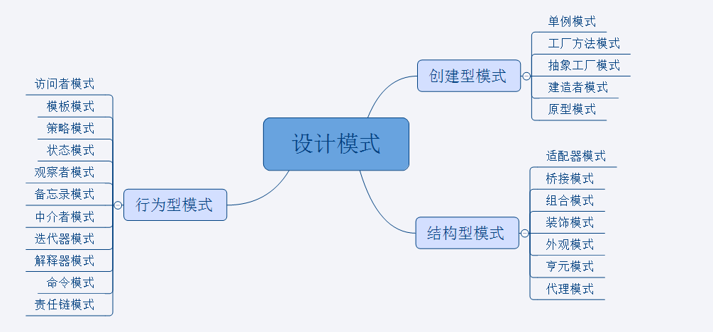

#### 设计模式概述
>1995 年，GoF（Gang of Four，四人组）合作出版了《设计模式：可复用面向对象软件的基础》一书，共收录了 23 种设计模式，从此树立了软件设计模式领域的里程碑，人称「GoF设计模式」。
这 23 种设计模式的本质是面向对象设计原则的实际运用，是对类的封装性、继承性和多态性，以及类的关联关系和组合关系的充分理解。

>设计模式（Design Pattern）是前辈们对代码开发经验的总结，是解决特定问题的一系列套路。它不是语法规定，而是一套用来提高代码可复用性、可维护性、可读性、稳健性以及安全性的解决方案。
>
>当然，软件设计模式只是一个引导，在实际的软件开发中，必须根据具体的需求来选择：
>* 对于简单的程序，可能写一个简单的算法要比引入某种设计模式更加容易；
>* 但是对于大型项目开发或者框架设计，用设计模式来组织代码显然更好。

#### 设计模式分类及关键点
>总体来说设计模式分为三大类：
>
>
>一、创建型模式，对象实例化的模式，创建型模式用于解耦对象的实例化过程。
>>1. [单例模式(singleton)](http://suo.im/6wKLXi "查看详解")：某个类只能有一个实例，提供一个全局的访问点。
>>2. [工厂方法(factoryMethod)](http://suo.im/5VPH5D "查看详解")：定义一个创建对象的接口，让子类决定实例化那个类。
>>3. [抽象工厂(abstractFactory)](http://suo.im/6aS74R "查看详解")：创建相关或依赖对象的家族，而无需明确指定具体类。
>>4. [建造者模式(builder)](http://suo.im/6iokte "查看详解")：封装一个复杂对象的构建过程，并可以按步骤构造。
>>5. [原型模式(prototype)](http://suo.im/6ioklE "查看详解")：通过复制现有的实例来创建新的实例。
>
>二、结构型模式，把类或对象结合在一起形成一个更大的结构。
>
>>1. [适配器模式(adapter)](http://suo.im/5Ojwec "查看详解")：将一个类的方法接口转换成客户希望的另外一个接口。
>>2. [组合模式(composite)](http://suo.im/5Ojwec "查看详解")：将对象组合成树形结构以表示“”部分-整体“”的层次结构。
>>3. [装饰模式(decorator)](http://suo.im/6pUzWX "查看详解")：动态的给对象添加新的功能。
>>4. [代理模式(proxy)](http://suo.im/6wKMYc "查看详解")：为其他对象提供一个代理以便控制这个对象的访问。
>>5. [亨元模式(flyweight)](http://suo.im/6ioprM "查看详解")：通过共享技术来有效的支持大量细粒度的对象。
>>6. [外观模式(facade)](http://suo.im/6pTVgd "查看详解")：对外提供一个统一的方法，来访问子系统中的一群接口。
>>7. [桥接模式(bridge)](http://suo.im/6aSazD "查看详解")：将抽象部分和它的实现部分分离，使它们都可以独立的变化。
>
>三、行为型模式，类和对象如何交互，及划分责任和算法。
>
>
>>1. [模板模式(template)](http://suo.im/5OjpZ6 "查看详解")：定义一个算法结构，而将一些步骤延迟到子类实现。
>>2. [解释器模式(interpreter)](http://suo.im/5zlF5g "查看详解")：给定一个语言，定义它的文法的一种表示，并定义一个解释器。
>>3. [策略模式(strategy)](http://suo.im/6pUub3 "查看详解")：定义一系列算法，把他们封装起来，并且使它们可以相互替换。
>>4. [状态模式(state)](http://suo.im/5zl24o "查看详解")：允许一个对象在其对象内部状态改变时改变它的行为。
>>5. [观察者模式(observer)](http://suo.im/5zlBlY "查看详解")：对象间的一对多的依赖关系。
>>6. [备忘录模式(memento)](http://suo.im/5Ojr3e "查看详解")：在不破坏封装的前提下，保持对象的内部状态。
>>7. [中介者模式(mediator)](http://suo.im/6wKIfi "查看详解")：用一个中介对象来封装一系列的对象交互。
>>8. [命令模式(command)](http://suo.im/5VPFoD "查看详解")：将命令请求封装为一个对象，使得可以用不同的请求来进行参数化。
>>9. [访问者模式(visitor)](http://suo.im/6aS2SH "查看详解")：在不改变数据结构的前提下，增加作用于一组对象元素的新功能。
>>10. [责任链模式(chainOfResponsibility)](http://suo.im/5GNiDp "查看详解")：将请求的发送者和接收者解耦，使的多个对象都有处理这个请求的机会。
>>11. [迭代器模式(iterator)](http://suo.im/6pUwa7 "查看详解")：一种遍历访问聚合对象中各个元素的方法，不暴露该对象的内部结构。

#### 设计模式的[六大原则](http://suo.im/5zljoK "查看详解")
>总原则：开闭原则（Open Close Principle）
>
>开闭原则就是说对扩展开放，对修改关闭。在程序需要进行拓展的时候，不能去修改原有的代码，而是要扩展原有代码，实现一个热插拔的效果。所以一句话概括就是：为了使程序的扩展性好，易于维护和升级。想要达到这样的效果，我们需要使用接口和抽象类等，后面的具体设计中我们会提到这点。
>
>1.单一职责原则
>>不要存在多于一个导致类变更的原因，也就是说每个类应该实现单一的职责，如若不然，就应该把类拆分。
>
>2.里氏替换原则（Liskov Substitution Principle）
>>里氏代换原则(Liskov Substitution Principle LSP)面向对象设计的基本原则之一。 里氏代换原则中说，任何基类可以出现的地方，子类一定可以出现。 LSP是继承复用的基石，只有当衍生类可以替换掉基类，软件单位的功能不受到影响时，基类才能真正被复用，而衍生类也能够在基类的基础上增加新的行为。里氏代换原则是对“开-闭”原则的补充。实现“开-闭”原则的关键步骤就是抽象化。而基类与子类的继承关系就是抽象化的具体实现，所以里氏代换原则是对实现抽象化的具体步骤的规范。
—— From Baidu 百科  里氏替换原则中，子类对父类的方法尽量不要重写和重载。因为父类代表了定义好的结构，通过这个规范的接口与外界交互，子类不应该随便破坏它。
>
>3.依赖倒转原则（Dependence Inversion Principle）
>>这个是开闭原则的基础，具体内容：面向接口编程，依赖于抽象而不依赖于具体。写代码时用到具体类时，不与具体类交互，而与具体类的上层接口交互。
>
>4.接口隔离原则（Interface Segregation Principle）
>>这个原则的意思是：每个接口中不存在子类用不到却必须实现的方法，如果不然，就要将接口拆分。使用多个隔离的接口，比使用单个接口（多个接口方法集合到一个的接口）要好。
>
>5.迪米特法则（最少知道原则）（Demeter Principle）
>>就是说：一个类对自己依赖的类知道的越少越好。也就是说无论被依赖的类多么复杂，都应该将逻辑封装在方法的内部，通过public方法提供给外部。这样当被依赖的类变化时，才能最小的影响该类。
最少知道原则的另一个表达方式是：只与直接的朋友通信。类之间只要有耦合关系，就叫朋友关系。耦合分为依赖、关联、聚合、组合等。我们称出现为成员变量、方法参数、方法返回值中的类为直接朋友。局部变量、临时变量则不是直接的朋友。我们要求陌生的类不要作为局部变量出现在类中。
>
>6.合成复用原则（Composite Reuse Principle）
>>原则是尽量首先使用合成/聚合的方式，而不是使用继承。

---
代码出处： 
微信公众号：Java知音[Java_friends] 《[设计模式](https://mp.weixin.qq.com/s/XLyvUBftV2UFamvWyYIIRw "Java知音")》专栏中 
md文档内容出处： 
[23种设计模式全面解析（超级详细）](http://c.biancheng.net/design_pattern/ "C语言中文网") 
[23种设计模式全解析](https://www.cnblogs.com/geek6/p/3951677.html "CSDN博客") 
[JAVA设计模式总结之23种设计模式](https://www.cnblogs.com/pony1223/p/7608955.html "CSDN博客")